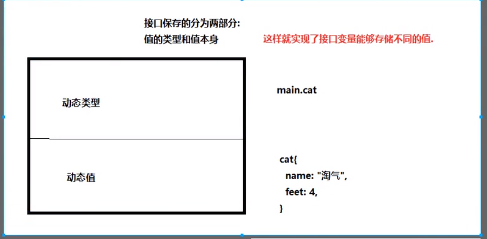
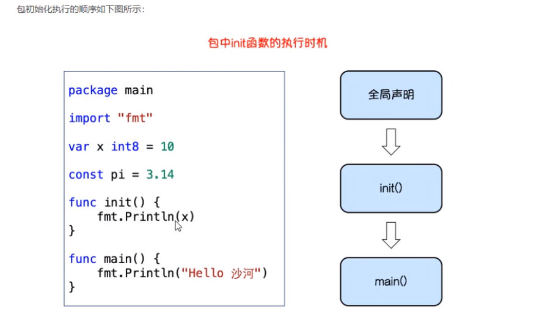

## 结构体内容回顾

##### 结构体：

​	保存多维数据类型的自定义类型

##### 匿名结构体

##### 构造函数

##### 方法和接收者

##### 结构体的嵌套

##### 结构体的匿名字段

##### JSON序列化与反序列化

## 今日内容

### 接口（interface）

接口是一种类型

在编程中会遇到以下场景：

​		我不关心一个变量是什么类型，我只关心它能调用那些方法。

```
//03_interface
package main
//引出接口实例

type speaker interface{
	speak() // 只要实现了speak方法的结构体都可当成speaker类型
}

type cat struct{}
type dog struct{}
func (c *cat)speak(){
	fmt.Println("miao")
}
func (c *dog)speak(){
	fmt.Println("wang")
}
//该方法参数x需要支持既能传dog也能传cat？？？
func da(x){
	//接收一个参数，传进什么来，我就打什么。然后调用speak
	x.speak()
}
func main(){

}
```

#### 接口定义

```
type 接口名 interface{
	方法名1(参数1，参数2，。。。)(返回值1，返回值2)
	方法名2(参数1，参数2，。。。)(返回值1，返回值2)
	.。。
}
```

用来给变量、参数返回值等设置类型

#### 接口的实现

一个变量实现了接口中规定的所有方法，那么这个对象就实现了这个接口。可以称为这个接口变量的类型。

接口类型的保存内容：



#### 值接收者和指针接收者区别：

- 值接收者实现接口，结构体类型和结构体指针烈性都能存
- 使用指针接收者：只能存放结构体指针

#### 接口和类型的关系

- 多个类型可以实现同一个接口
- 

#### 接口嵌套

```
type mover interface{
	move()
}
type eater interface{
	eat()
}
type animal interface{
	mover
	eater
}
```

#### 空接口

​		所有的类型都实现了空接口。也就是任意类型的变量都能保存到空接口

```
interface{} //空接口是一种类型
比如fmt.Println(a ...interface{}) //可以接收任意类型的打印
```

#### 类型断言

​		空接口可以存储任意类型的值， 那我们如何获取其具体存储的数据呢？

```
//类型断言
// x.(T)
//使用switch进行类型判断
func asserts(a interface{}){
	switch a.(type){
	case string:
		fmt.Printf("Is a string %s\n",a.(string))
	case int:
		fmt.Printf("Is a int %d\n",a.(int))
	}
}
```

### 包（package）

- 自己实现的包导入路径从$GOPATH/src后面的路径 开始写
- 想被别的包调用的标识符首字母都需要大写
- 单行导入和多行导入
- 导入包时可以指定别名
- 导入包不想使用内部的标识符，需要使用匿名导入
- Go语言禁止循环导入包 A-》B-》C-》A
- 每个包被导入时会自动执行一个init函数

#### 匿名导入：

```
import _ "包路径" //一般为了调用导入包的init函数
```

#### init函数：

在Go语言中导入包是会自动执行该包内的init函数（该函数可以不实现）



典型应用：比如导入go-sql-driver/mysql包时

```
import(
	_ "github.com/go-sql-driver/mysql"
)
```


### 文件操作

#### 打开和关闭文件：

```
os.Open
```

读取文件：

```
fileObj, err := os.Open("xxx")
//创建文件读取对象
reader := bufio.NewReader(fileObj)
line, err := reader.ReadString('\n')
if err == io.EOF{
	fmt.Println("read over")
	return
}
```

#### 文件写入操作

```
os.OpenFile(name string, flag int, perm FileMode)(*File, error)
```


### 实现一个日志库

自己实现一个日志库

接口

##### 需求：

1.可以往不同的输出位置记录日志

2.日志分为五种级别

接口：

​	日志可以输出到终端，也可以输出到文件，也可以输出到kafaka


