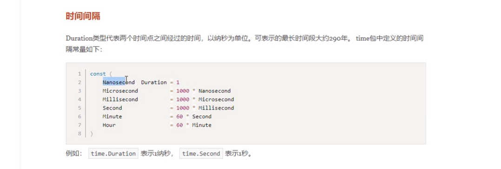

## Day06笔记

## 内容回顾

#### 接口interface

接口是一种很类型。

接口就是你要实现的方法清单

接口定义：

```
type xxxer interface{
	xxx()
}
```

接口的实现

​	实现了接口的所有方法，就实现了这个接口。

空接口：

```
interface{}		//interface是关键字
```

​	所有类型都实现了空接口。任意类型都可以存放到空接口

​	作为参数，可以接受任意类型的参数。

类型断言:

​	做类型断言的前提是一定要是一个借口类型的变量

```
//x.(T)
var a interface{}
a =100
if v,ok := a.(int8); !ok{
	fmt.Printf("%v %v",v,ok)
}
//使用switch来做类型断言
switch x.(type){
	case string:
	case int64:
}
```


- 动态类型
- 动态值

#### 包package

包的定义-->package关键字，包名通常和路径名一致

包的导入-->import关键字

- 单行导入

- 多行导入

- 给导入得包起别名

- 匿名导入

- 包中的标识符如果想被别的包使用则首字母需要大写。

init()函数：

- 包导入时会自动执行
- 一个包里面只有一个init
- 多个包的init执行顺序
- 一般多用于初始化操作

#### 文件操作

##### 打开文件和关闭文件

```
fp, err:=os.Open("xx.txt") // 打开只读文件句柄
```

##### 读文件

func (f *File) Read(b []byte) (n int, err error)

```
var buf [128]byte
fp.Read(buf[:])
//使用bufio读取数据
reader := bufio.NewReader(fp)
line, err := reader.ReadString('\n') //读取一行

```


##### 写文件

```
//写文件需要有写权限
func OpenFile(name string, flag int, perm FileMode) (*File, error) // 可以设置打开文件句柄权限
fp, err := os.OpenFile("./xx.txt",os.O_CREATE, 0644)

```


## 今日内容

### time包

```
import (
	"time"
)
func main(){
	t := time.Now()
	fmt.Println(t.Year())
	fmt.Println(t.Month())
	fmt.Println(t.Date())
	fmt.Println(t.Hour())
	//时间戳：
	fmt.Println(t.Unix())
	fmt.Println(t.UnixNano())
	// time.Unix()
	// 可以将一个数值转换成时间格式
	ret := time.Unix(1564803667)
}
```

##### 时间间隔



时间间隔：

Go语言时间格式比较特殊：

​	年      月   日    时    分   秒

​	2006-01-02    15：04：05

```
//时区
func f2(){
	now := time.Now() // 本地时间
	fmt.Println(now)
	
	// 获取明天这个时间
	time.Parse("2006-01-02 15:04:05", "2020-01-19 07:11:22")
	/按照东八区和合格式解析一个字符串
	loc, err := time.LoadLocation("Asia/Shanghai")
	if err!= nil {
		fmt.Println("load location failed")
		return
	}
	tobj, err := time.ParseInLocation("2006-01-02 15:04:05", "2020-01-19 07:11:22", loc)
	if err != nil{
		return
	}
	fmt.Println(tobj)
}

func main() {
	f2()
}
```


### 日志库

##### 需求分析：

1. 支持往不同得地方输出日志

2. 日志分级别
   - Debug
   - Trace
   - Info
   - Warning
   - Error
   - Fatal

3. 日志要支持开关控制。比如说开发的时候什么级别都能输出，但是上线之后只有Info以上得级别可以输出。

4. 完整的日志要包含时间戳、行号、文件名、日志级别、日志inxi

5. 日志文件要实现切割

    ​	按照文件大小切割

    ​			每次记录日志之前判断当前文件大小，如果超出阈值，进行切割。

    ```
    //文件对象的类型
    
    func main(){
    	fp, err := os.Open("./main.go")
    	if err!=nil{
    		panic(err)
    	}
    	fmt.Printf("%T\n", fp)
    	//获取文件对象的详细信息
    	fInfo, err := fp.Stat()
    	if err != nil{
    		panic(err)
    	}
    	fmt.Printf("%d\n",fInfo.Size())
    }
    ```

    ​	按照日期切割

#### 获取执行代码文件行号、文件名：

```
func f1(){
	pc,file,line,ok := runtime.Caller(1)
	if !ok{
		fmt.Println("runtime.Caller() failed")
		return 
	}
	//获取函数
	funcName := runtime.FuncForPC(pc).Name()
	fmt.Println(funcName)
	fmt.Println(file)
	fmt.Println(line)
}
func main(){
	f1()
}
```


### 反射

