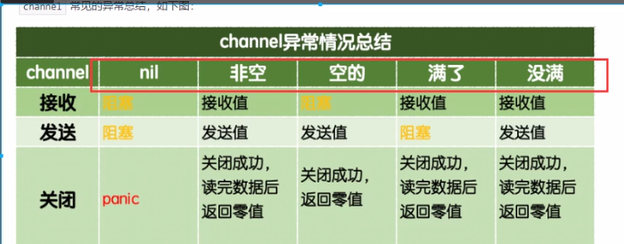

## Day07

## 内容回顾

#### time包

```
//时间格式
2006-01-02 15：04:05
```

时间类型：

```
import(
	"time"
)
now := time.Now()

```

时间操作:

```
time.After
time.Sub
time.Before
```

#### 反射：

接口类型底层分为两部分：动态类型和动态值

反射机制应用：json徐磊话， orm关系映射

```
//reflect 包
reflect.TypeOf(x)
reflect.ValueOf(x)
```

#### ini解析：

```
//config.ini
[mysql]
address=10.10.10.4
port=3306
username=root
password=roor@root
# 这是一个注释文件
[redis]
host=127.0.0.1
port=6379
password=root
database=0
```

解析配置文件：

```

```


## 今日内容

### 并发

### goutine:

#### goroutine结束时间：

​	goroutine对应的函数执行结束，goroutine退出。

#### 调度：需要查文档

`M:N`:把M个goroutine分配给n个操作系统线程去执行

goroutine初十栈的大小是2K

### channel：

```
//创建channel
var a chan int // 创建存放int类型的channel， channel是引用类型，需要申请内存空间才可以使用

a = make(chan int, 100)
fmt.Println(a)
```

##### 通道的操作：



`<-`

​	1.向管道写数据 `ch1 <- 1`

​    2.从管道取出数据：`<-ch1`

​	3.关闭通道  			`close(ch1)`

关闭通道：

`close(ch)`

1.读已经关闭通道     不报错       能够获取通道内剩余的值，如果通道内没有值获取的值为对应类型0值

单向通道：多用于函数参数中

```
func f2(ch1 chan<-, ch2 chan<-  int){

}
```


### sync

```
// sync.WaitGroup
import (
	"math/rand"
)
func f1(){
	r1 := rand.Int()
    r2 := rand.Intn(10)
    fmt.Println(r1,r2)
}
```

