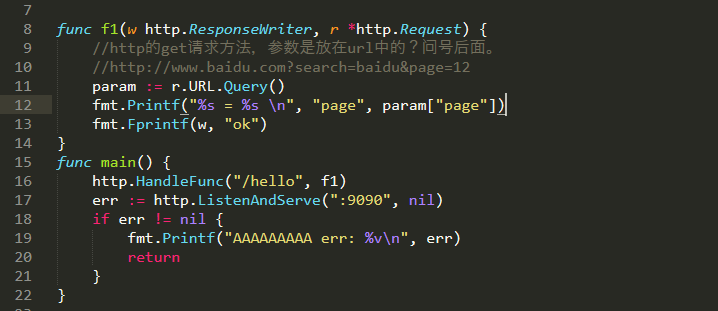
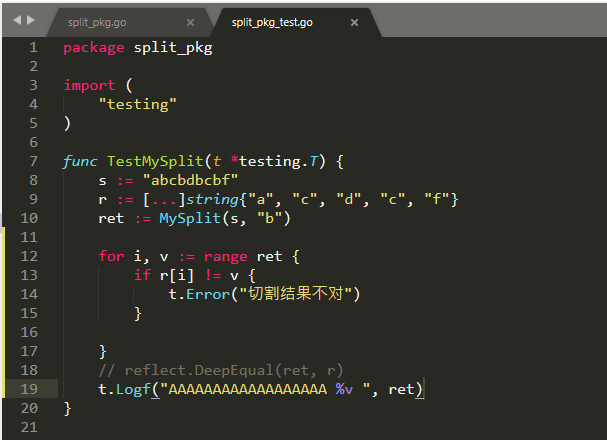

# Day09

## 内容回顾

#### 锁

`sync.Mutex`

​			是一个结构体，是值类型，给参数传参数的时候要传指针。

`两个方法`：

```
var lock synx.Mutex
lock.Lock()
lock.Unlock()
//为什么要加锁？
//防止多个goroutine数据竞争，数据不正确。
```

#### 等待组

`sync.WaitGroup`:

​		是一个结构体，值类型，当作参数传递时须使用指针传递。

```
var wg sync.WairGroup
//没开启一个goroutine调用增加1
wg.Add(1)
//goroutine结束时调用，告知等待组减1
wg.Done()

//等待所有goroutine结束
wg.Wait()
```


#### 读写互斥锁：

应用场景：当读操作远多于写操作。

特点：

​		1.读的`goroutine`来了获取的是读锁， 后续的`goroutine`能继续读，但不能写

​		2.写的`goroutine`来了获取的是写锁，后续的`goroutine`，均不能读、写。

使用：

```
var rwLock sync.RWMutex
//读锁
rwLock.RLock()
rwLock.RUnlock()
//互斥锁
rwLock.Lock()
rwLock.Unlock()
```

#### `sync.Once`:

使用场景：某些多线程场景，函数只需要执行一次。

```
var once sync.Once
//多个线程关闭同一个channel。。。
once.Do(func(){close(ch)})
```


## 今日分享：

### 开发注意事项：

​			注释、日志、单元测试

​			规范起来

## 今日内容

## net/http

解析http的GET方法请求的参数：



### context

### 单元测试

开发测试自己写的代码的测试工具

`所有的测试文件都以：_test.go结尾`

```
测试函数			函数名前缀为Test			测试程序的一些逻辑行为
基准测试			函数名前缀为Benchmark		测试函数的性能
```

测试函数：

```
func TestXxxxx(t *testing.T){
}
```



`测试组和子测试`：

​	测试组就是将一组数据包装成一个结构体数组然后遍历执行。

### pprof调试工具